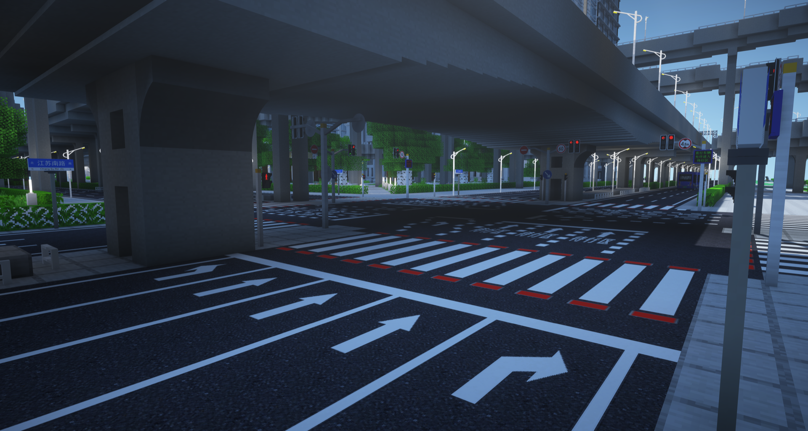
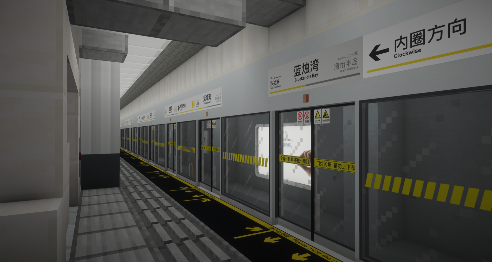

# NebulaeCraft

NebulaeCraft is a Minecraft Forge mod made for the NebulaeCraft 5th Server, focused on detailed modern city, road, and metro construction.

What is NebulaeCraft?

- NebulaeCraft is a city-building deco mod that adds modular blocks for roads, rail transit, public facilities, lighting, and signage.
- The goal is to make dense urban scenes feel believable while keeping the freedom of Minecraft-scale building.
- It includes road surfaces, lane markings, traffic signs, signals, barriers, street lights, platform equipment, catenary systems, and metro station details.
- Several blocks include variants, subtypes, or custom behavior, such as editable roadmark text and organized creative tabs.

Versions [Forge]: 1.12.2

Current Mod Version: 2.22

Download: [Releases](https://github.com/NebulaeCraft/NebulaeCraft-Mod/releases)

More Pictures:

Features summary:

- <u>Road system</u> with asphalt blocks, slabs, white/yellow lane lines, guide lines, stop lines, bus lanes, bicycle lanes, crosswalks, and road expansion joints
- <u>Road markings</u> including arrows, pedestrian crossings, wheelchair markings, bus-only text, variable lanes, slowdown markings, and custom text roadmarks
- <u>Traffic facilities</u> such as traffic lights, counters, poles, cameras, crash barrels, road fences, median strips, anti-glare shields, and noise barriers
- <u>Road signs</u> covering warning, guide, direction, prohibition, speed limit, height limit, one-way, merge, parking, and lane-use signs
- <u>Metro station blocks</u> including platform screen doors, platform edges, platform fences, security light bars, PSL panels, station label signs, and information screens
- <u>Rail infrastructure</u> with third rails, rigid catenary, flexible catenary, gantries, brackets, droppers, transition pieces, trackbed blocks, and railway fences
- <u>Lighting and city details</u>: lamps, lanterns, flat lights, strip lights, tunnel lights, dustbins, fire extinguisher boxes, electronic devices, and route-color blocks

For more info, please visit the [NebulaeCraft Wiki](https://wiki.knebulae.com).

(c) 2017-2026 NebulaeCraft. All Rights Reserved.
